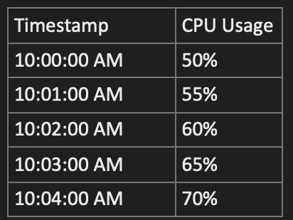

# Prometheus Query Laungage

## Data Types

1. Scalar
    * sum(http_server_requests_seconds_count) -> 20
2. Instant vector
    * http_server_requests_seconds_count -> 20@1725543166.223
3. Range vector
    * http_server_requests_seconds_count[5m] -> 21104 @1725543166.223
                                                21105 @1725543196.223
                                                21106 @1725543226.223
                                                21107 @1725543256.223

## Types of metrics

1. Gauges
    * The value can go up and down. It represents the current value or count at point in time.
    * Eg: cup_utilization, disk space, temperature etc.

2. Counters
    * They represent a cumulative count over time. Only increasing.
    * Eg: total number of http requests handled by application.
    * Intresting analysis would be how fast the counter moving over a period of time i.e rate of increase.

3. Histograms
    * cumulative histograms with boundaries. le (less than or equal)

4. Summary
    * A summary is similar to histogram. However it calculates quantile values for pre-configured values.

## Metrics conventions

1. metric_count
    * It is a counter that stores the total number of data points.
2. metric_sum
    * It is a gauge that stores the value of all data points that added together.
    * The sum can be used as a counter for all histograms where negative values are impossible
3. metric_bucket
    * Is a collection of counters in which a label is used to support calculating the distribution of the values.
    * The buckets are cumulative
    * The +Inf bucket, which should hold the same values as _count

## Functions

1. increase() - gives the total increase over time. Absolute value of increase, rather than per second
2. rate() - per second increase, averaged over the entire input of range window
3. irate() - per second rate of increase, last two samples of the entire input of range window - instantaneous range



* increase()

    ```sh
    (70% - 50%) = 20%
    ```

* rate()

    ```sh
    (70% - 50%) / (10:04:00 AM - 10:00:00 AM) 

    20% / 4 minutes = 5% per minute

    5% per minute / 60 seconds = 0.0833% per second
    ```

* irate()

    ```sh
    (70% - 65%) / (10:04:00 AM - 10:03:00 AM)

    5% / 1 minute = 5% per minute

    5% per minute / 60 seconds = 0.0833% per second
    ```

* histogram_quantile()


```sh

```
